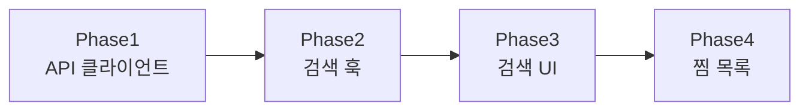
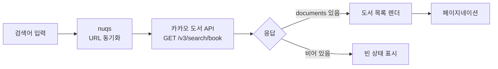
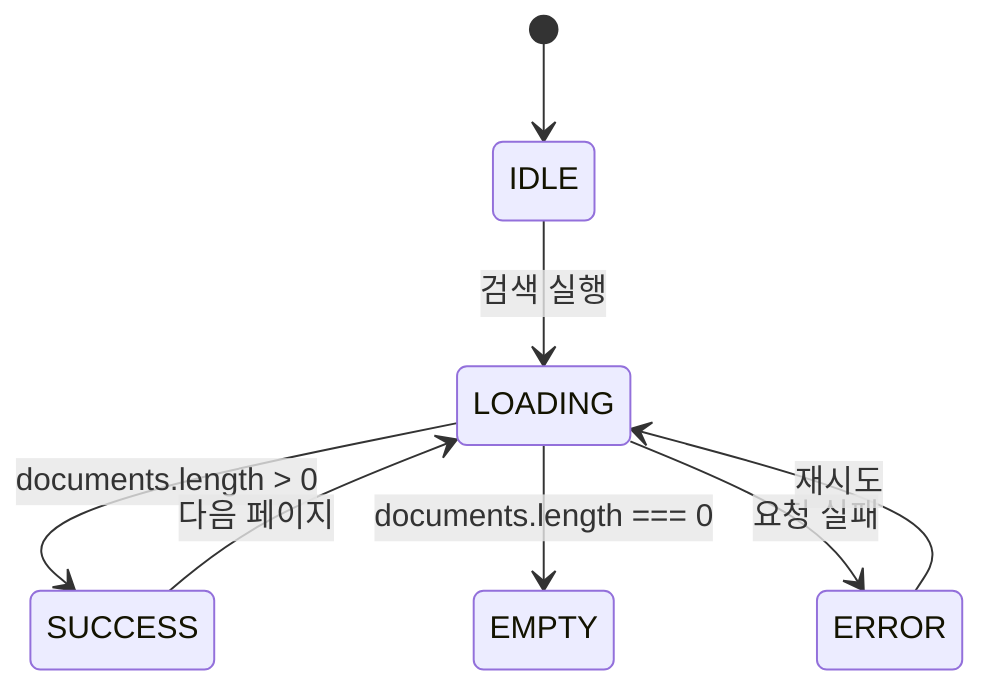

# plan 다이어그램 갤러리 (Mermaid)

> planning 스킬이 생성하는 plan 문서(`.docs/plans/*.md`)에 인라인하는 Mermaid 다이어그램 표준. SOT는 `.md` — GitHub·VSCode·IDE가 ` ```mermaid ` 블록을 네이티브 렌더한다. HTML 변환·빌드 명령 불필요.
> 본 갤러리 호출 컨텍스트: `../SKILL.md` "다이어그램" 절.

## 어느 다이어그램을 고르나 (선택 가이드)

plan에 **아래 요소가 있을 때만** 해당 다이어그램을 추가한다. 전부 그릴 필요 없다 — **Phase 흐름도 1종이 사실상 기본**, 나머지는 조건부.

| plan에 이런 게 있으면 | 다이어그램 | 빈도 |
|---|---|---|
| Phase 2개 이상 (거의 모든 중규모+ plan) | **flowchart** (Phase 흐름) | 기본 (항상) |
| 다단계 데이터 변환·합성 (검색어 → API → 정규화 → 렌더) | **flowchart** (데이터 파이프라인) | 조건부 |
| 상태 전이 (쿼리 idle→loading→success/error/empty) | **stateDiagram** (상태 전이) | 조건부 |

- **소규모 plan(파일 1~3개)은 면제** — 다이어그램 없이 체크리스트만으로 충분
- 강제 아님: 다이어그램이 오히려 노이즈면 생략. 목적은 "한눈에 구조 파악"이지 장식이 아님

---

## 1. flowchart — Phase 흐름 (기본·거의 항상)

**언제**: Phase가 2개 이상인 모든 plan. Phase 간 의존·순서를 한눈에.



- 가로 흐름은 `LR`(left-right), 세로는 `TD`(top-down)
- 병렬 Phase는 한 노드에서 두 갈래로 분기 → 합류 노드로 재수렴

---

## 2. flowchart — 데이터 파이프라인 (다단계 변환 시)

**언제**: 입력 → 처리 → 출력이 여러 단계로 이어지는 변환 파이프라인.



- `{...}` = 분기/판정 노드, `[...]` = 처리 노드
- `-->|라벨|` = 화살표에 조건 라벨

---

## 3. stateDiagram-v2 — 상태 전이

**언제**: 쿼리/UI 상태가 단계별로 전이될 때. `[*]`는 시작/종료.



- 전이 라벨(`: 사유`)에 **트리거 조건**을 적으면 "왜 이 전이가 일어나나"가 드러남
- 상태명을 코드의 상태값과 1:1로 맞추면 검증이 쉬움

---

## 작성 가이드 (커밋 전 체크)

- **한글 라벨 OK**. 줄바꿈은 `<br/>` (노드 안), 공백 포함 라벨은 `"..."`로 감쌈
- **커밋 전 IDE 미리보기로 렌더 확인** — Mermaid 문법 오류는 GitHub에서 깨진 코드블록으로 노출됨. VSCode는 Markdown Preview(내장 Mermaid) 또는 `Markdown Preview Mermaid Support` 확장
- **간결 우선**: 노드 10개 넘어가면 한눈 파악이 안 됨 → 핵심 경로만, 세부는 본문 표/텍스트로
- **위치**: plan 템플릿의 `## 다이어그램` 섹션(목표·배경 직후, 체크리스트 앞)에 모으거나, 관련 결정/Phase 옆에 인라인. 둘 다 허용

## 관련 자료

- 호출 컨텍스트: `../SKILL.md` "다이어그램" 절
- Mermaid 공식: `mermaid.js.org/intro/` (다이어그램 타입별 문법 SOT)
