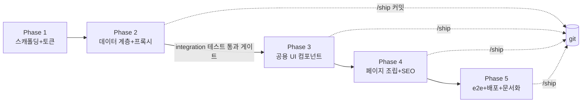
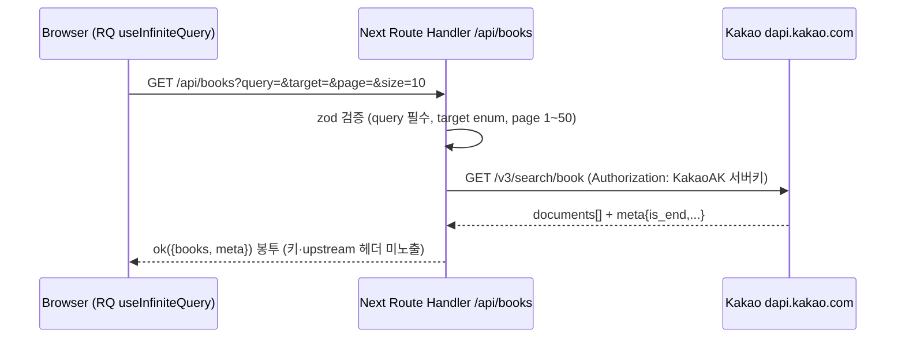

# book-search-app — 카카오 도서 검색/찜 (CDRI 사전과제)

> 상태: 🔵 진행 중 (사용자 승인 대기)

## 목표

카카오 책 검색 API 기반 도서 검색·찜 서비스를 Figma 명세와 1:1로 구현하고, 테스트·배포·문서화까지 3일 내 제출 가능한 완성도로 만든다.

## 배경 (3 Whys)

- 왜: CDRI 사전과제 제출 (기한: 수령 후 3일)
- 왜: 평가 기준 4개(재사용 컴포넌트 설계 / 가독성·유지보수성 / 상태관리·API 연동 / 성능 최적화)를 모두 근거 있게 충족해야 함
- 왜: 과제 규모가 작으므로 "설계의 근거"와 "과정의 통제"가 차별화 요소
- 실제 필요: 기능 구현 + **모든 선택의 근거 문서화** + AI 활용 과정의 투명한 기록

## 요구사항 (확정 — Figma 주석 [F] / 노션 [N] / 사용자 결정 [U])

- WHEN 검색어 입력 후 Enter THEN 10개씩 무한 스크롤로 결과 노출 [F]
- WHEN 검색 실행 THEN 검색 기록 저장 (최대 8개, 초과 시 오래된 순 삭제, 재시작 후 유지) [F]
- WHEN 상세검색(제목/저자명/출판사) 실행 THEN 전체 검색어 초기화, 역방향도 동일 (상호배타) [F]
- WHEN 상세보기 클릭 THEN 아코디언 확장 — **단일 열림** [U], 할인가 없으면(-1) 미노출 [F]
- WHEN 구매하기 클릭 THEN 새 탭으로 다음 책 상세(`url`) 이동 [F]
- WHEN 하트 클릭 THEN 찜 토글 — **클릭 시점 데이터 스냅샷** localStorage 저장, 재시작 후 유지 [F]
- WHEN `/favorites` 진입 THEN 찜 목록 10개씩 노출 + 카운트 [F]
- 카카오 REST 키는 서버 전용 — Route Handler 프록시 경유 [N+U]
- 반응형: 모바일~데스크톱 완전 대응 [U]
- SEO: `?q=` URL 서버 프리페치(HydrationBoundary) + generateMetadata [U]
- 책 소개 본문 10px 시안 준수 [U]
- 디자인 토큰·컴포넌트 스펙: `.docs/design/tokens.md`, `components.md` (Figma API 실측 — 참고용, 구현 시 Figma 재실측 가능)

## 현재 상태

- 레포: 하네스(.claude)·설계 문서(.docs)·CLAUDE.md·.gitignore만 존재. 앱 코드 0
- git: main 브랜치 초기화 완료, 커밋 0 (셋팅 커밋 예정 — 과정 문서는 그 이후부터)
- 환경: Node 24.13 / pnpm 10.33 / 최신: Next 16.2.10, Tailwind 4.3.2, RQ 5.101.2, nuqs 2.9.0
- 카카오 REST 키: **사용자 발급 대기** (MSW 스텁으로 키 없이 개발·테스트 가능, 실 브라우저 확인 시 필요)
- Vercel: 사용자 계정 연결 필요 (배포 Phase에서)

## 다이어그램

---

## 체크리스트

### Phase 1: 스캐폴딩 + 디자인 토큰 (파운데이션)

- [ ] Step 1.1: create-next-app 스캐폴딩
  - 작업: `pnpm create next-app` (TS, App Router, Tailwind v4, ESLint, src 미사용, `@/*` alias). README는 자체 작성으로 대체
  - 검증: `pnpm dev` 기동 + 기본 페이지 렌더
- [ ] Step 1.2: 코어 의존성 설치
  - 작업: `@tanstack/react-query axios qs nuqs react-hook-form zod @hookform/resolvers tailwind-variants` / dev: `vitest @vitejs/plugin-react @testing-library/react @testing-library/user-event jsdom msw @playwright/test husky lint-staged prettier prettier-plugin-tailwindcss @tanstack/react-query-devtools`
  - 검증: `pnpm check-types` 통과 (스크립트 추가 포함)
- [ ] Step 1.3: 엄격 설정
  - 작업: tsconfig `strict` + `noUncheckedIndexedAccess` + `noImplicitOverride`, prettier 설정, eslint 보강(unused-imports), package.json scripts(`dev/build/lint/check-types/test:unit/test:integration/test:e2e`)
  - 검증: lint·check-types 통과
- [ ] Step 1.4: husky + lint-staged
  - 작업: pre-commit = lint-staged(prettier+eslint --fix), pre-push = check-types. 커밋 메시지는 conventional commits 수동 준수 (commitlint은 개인 과제 오버헤드로 제외 — 결정 사항 참조)
  - 검증: 더미 커밋으로 훅 발동 확인
- [ ] Step 1.5: 디자인 토큰 + 폰트
  - 작업: `app/globals.css` `@theme` 토큰(tokens.md 실측 hex 11종 + radius 2종) + `@utility font-title1~small` 8종, next/font Noto Sans KR(400/500/700) 연결, `next.config.ts`에 카카오 썸네일 `remotePatterns` 등록
  - 검증: 데모 페이지에서 토큰 클래스 렌더 확인 후 제거
- [ ] Step 1.6: 환경 변수 설계
  - 작업: `.env.example`(KAKAO_REST_API_KEY=발급방법 주석), `.env.local` 자리표시 (실키는 사용자 제공 시)
  - 검증: guard-secrets 훅이 .env.local 커밋 차단하는지 확인

### Phase 2: 데이터 계층 + 카카오 프록시 (integration 테스트 게이트)

- [ ] Step 2.1: API 공통 계층
  - 작업: `app/api/shared/{response.ts(ok/fail 봉투),request.ts(parseQuery+zod),handleApiError.ts}` — 카카오 에러를 안전한 메시지로 매핑(키·upstream 원문 미노출)
  - 검증: unit 테스트 (봉투 shape, 에러 매핑)
- [ ] Step 2.2: 카카오 프록시 슬라이스
  - 작업: `app/api/books/{route.ts,service.ts,api.validation.ts,api.interface.ts}` — GET query/target/page/size, `KAKAO_REST_API_KEY` 서버 전용, `next: { revalidate: 60 }` 캐싱(동일 쿼리 60s — 근거: 도서 데이터 변동 낮음+rate limit 방어)
  - 검증: integration 테스트 — route handler 직접 호출, 카카오는 MSW node 스텁 (성공/빈결과/400/401/429/500, target 매핑, 키 미노출 assert)
- [ ] Step 2.3: 클라이언트 데이터 계층
  - 작업: `lib/api/client/http.ts`(axios+봉투 정규화 인터셉터), `lib/api/books/{api.ts,api.queries.ts}`(`useBookSearchInfiniteQuery` — keepPreviousData, is_end 기반 getNextPageParam), `lib/api/shared/queryKeys.ts`
  - 검증: 훅 unit 테스트 (QueryClientProvider wrapper + MSW)
- [ ] Step 2.4: 찜/검색기록 저장소
  - 작업: `lib/storage/{favorites.ts,searchHistory.ts}`(localStorage, SSR 가드, max 8 FIFO) + `lib/api/favorites/api.queries.ts`(RQ로 래핑 — 캐시 무효화로 페이지 간 동기화)
  - 검증: unit 테스트 (8개 초과 FIFO, 토글, SSR 환경 no-throw)
- [ ] Step 2.5: 🚧 **게이트 — integration 전체 통과 후 Phase 3 진입** (사용자 프로세스)
  - 검증: `pnpm test:unit && pnpm test:integration` 전체 green → /ship 커밋

### Phase 3: 공용 UI 컴포넌트 (Figma 1:1)

- [ ] Step 3.1: Button(3 variants×4 sizes) / Input(pill+underline) / Select
  - 검증: check-types + 데모 조합 렌더
- [ ] Step 3.2: Popover(포커스 트랩+Esc+외부클릭) / LikeButton(SVG 하트, aria-pressed) / EmptyState / Skeleton / ResultCount
  - 검증: LikeButton·Popover RTL 테스트 (키보드 조작)
- [ ] Step 3.3: Header (GNB, aria-current, 반응형)
  - 검증: /review-ui (토큰 준수·정렬)

### Phase 4: 페이지 조립 + SEO

- [ ] Step 4.1: 도서 검색 페이지 수직 슬라이스
  - 작업: `app/{page.tsx,hooks/useBookSearch.ts,components/,styles/}` — SearchBar(기록 8개), DetailSearchPopover(상호배타 로직), BookList(무한스크롤 IntersectionObserver), BookListItem(아코디언 단일 열림), nuqs `?q=&target=`
  - 검증: 브라우저 수동 확인 + RTL 통합(검색→결과→아코디언)
- [ ] Step 4.2: 찜 페이지
  - 작업: `app/favorites/{page.tsx,hooks/useFavorites.ts}` — BookList 재사용, 클라 페이지네이션(10개), 빈 상태
  - 검증: 찜 토글 ↔ 목록 동기화 확인
- [ ] Step 4.3: SEO — 서버 프리페치 + 메타데이터
  - 작업: 검색 페이지 서버 컴포넌트에서 `?q=` 존재 시 prefetchInfiniteQuery + HydrationBoundary, generateMetadata(동적 title/OG), favicon/OG 기본
  - 검증: `curl`로 초기 HTML에 결과 포함 확인, 메타 태그 확인
- [ ] Step 4.4: 반응형 마감
  - 작업: 리스트 아이템 모바일 세로 적층, Header/SearchBar 축소, 아코디언 모바일 레이아웃
  - 검증: /review-ui 뷰포트 3종(375/768/1280) + Lighthouse(P≥90, A11y≥90 목표)

### Phase 5: e2e + 배포 + 문서화

- [ ] Step 5.1: Playwright e2e
  - 작업: 핵심 여정 — 검색→무한스크롤→아코디언→찜→/favorites 확인→찜 해제→기록 확인. 카카오 프록시는 route interception 스텁 + (키 있으면) 실 API 스모크 1건
  - 검증: `pnpm test:e2e` green
- [ ] Step 5.2: 성능 패스
  - 작업: next/image(썸네일), 번들 분석, 불필요 "use client" 제거, RQ staleTime 정책
  - 검증: Lighthouse Performance ≥ 90
- [ ] Step 5.3: Vercel 배포 (사용자: 계정 연결 + env 등록)
  - 검증: 프로덕션 URL 스모크 + 배포 환경에서 키 미노출 재확인
- [ ] Step 5.4: README.md + 과정 문서(readme.html)
  - 작업: README(개요/실행/폴더구조/**라이브러리 선택 이유**/강조 기능) + 과정 문서(planning→구현→리뷰→ship 흐름, 훅·규칙 동작 증거, 셋팅 과정 제외) + html 렌더
  - 검증: 신규 클론 → `pnpm i && pnpm dev` 재현 테스트

### 최종 검증

- [ ] pnpm check-types / lint / test:unit / test:integration / test:e2e
- [ ] /review (Quality Gate ≥ 70, Blocking 0)
- [ ] /review-ui + Lighthouse
- [ ] /security (카카오 키 은닉 체크리스트 — 빌드 산출물 grep 포함)
- [ ] 브라우저 최종 확인 (Chrome/Safari/모바일 뷰포트)

---

## 수정 파일 목록 (신규 생성 위주, 주요만)

| 파일 | 작업 |
|---|---|
| `app/{layout,page}.tsx`, `app/globals.css`, `next.config.ts` 등 스캐폴딩 | 신규 |
| `app/api/shared/*`, `app/api/books/*` (4파일 슬라이스) | 신규 |
| `lib/api/{client,books,favorites,shared}/*`, `lib/storage/*` | 신규 |
| `components/{Button,Input,Select,Popover,LikeButton,EmptyState,Skeleton,ResultCount,Header}/*` | 신규 |
| `components/book/{BookList,BookListItem}/*` | 신규 |
| `app/hooks/useBookSearch.ts`, `app/components/*`, `app/styles/*` | 신규 |
| `app/favorites/*` | 신규 |
| `__tests__/{unit,integration}/*`, `e2e/*`, `vitest.*.config.ts`, `playwright.config.ts` | 신규 |
| `.husky/*`, `.env.example`, `README.md`, `docs/process/*` | 신규 |

## 실행 모드

**단일 세션 직접 구현** (CLAUDE.md 규약 — 페이지 2~3개 규모). 리뷰 객관성이 필요한 시점(Phase 4 완료 후)에 reviewer 에이전트 1회 spawn. Phase별 /ship 커밋으로 과정 기록.

## 실패 위험 (Pre-mortem)

- [ ] 카카오 키 미발급 상태 장기화 → MSW로 개발 지속 가능하나 실 스모크·배포 검증 지연 (사용자 액션 필요)
- [ ] next/image 카카오 썸네일 도메인 누락 → `search1.kakaocdn.net` 등 remotePatterns 선등록, 텅 빈 thumbnail("" 값) fallback UI
- [ ] localStorage SSR/hydration mismatch → 찜 카운트·기록은 mounted 가드 후 렌더 (깜빡임은 skeleton으로)
- [ ] Tailwind v4 `@utility` + tv() 조합 클래스 미인식 → 토큰 유틸은 globals.css 정의라 safe, 데모 페이지로 Phase 1에서 조기 검증
- [ ] 무한스크롤 + 아코디언 열림 상태 유지 → 페이지 append 방식(가상화 미사용)이라 상태 보존, e2e로 회귀 방지
- [ ] Playwright e2e가 실 카카오 호출 → route interception으로 차단, CI 없는 로컬 실행 기준
- [ ] Next 16 관련 문서-구현 차이(middleware→proxy.ts 등) → 이 과제는 미들웨어 불사용, 공식 문서 external-docs 룰로 확인

## 결정 사항

- 아코디언 **단일 열림**: 시안 표현 근거 [U 2026-07-07]
- 책 소개 본문 **10px 시안 준수**: Figma 실측 명시 스펙 — 픽셀 퍼펙트 우선, README에 가독성 고려 주석 [U]
- **완전 반응형**: 원티드 우대사항 + 평가 초과 어필 [U]
- **서버 프리페치 + generateMetadata**: Next.js 선택 근거 강화 [U]
- Next **16.2.x** 채택: 최신 stable, 직전 프로젝트와 동일 세대 — 학습 리스크 없음
- commitlint 제외, conventional commits 수동 준수: 개인 과제 오버헤드 최소화 (husky+lint-staged만)
- 프록시 60s revalidate 캐싱: 도서 데이터 저변동 + rate limit 방어 (README 근거 기록)
- 전역 상태 라이브러리 미도입: RQ+nuqs+localStorage+Context로 충분 — "필요 없음의 근거" 자체를 README에 기술
- Node 런타임(기본) 사용, Edge 미사용: axios·MSW 호환 우선

## 발견 사항 / backlog

→ `.docs/plans/book-search-app.backlog.md` (피드백 원장)

## 컨벤션 변경 필요

- (진행 중 기록)
