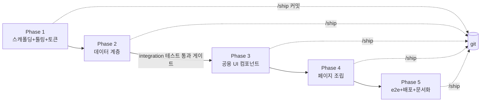
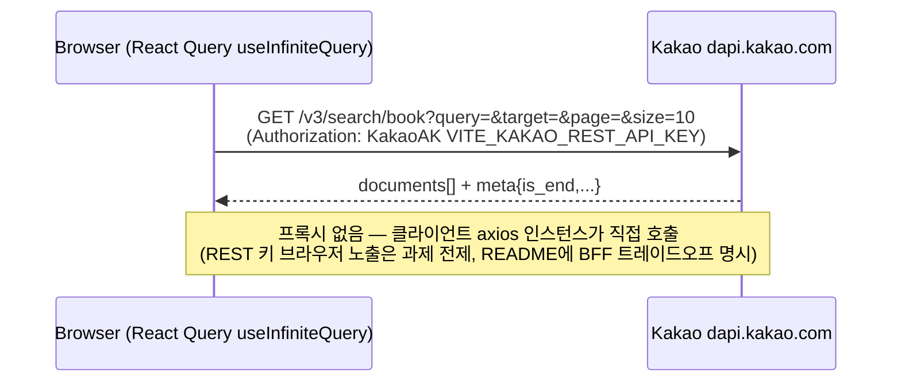

# book-search-app — 카카오 도서 검색/찜 (CDRI 사전과제)

> 상태: 🔵 진행 중 (Vite + React CSR 기준 전면 개정 — 2026-07-08)

## 목표

카카오 책 검색 API 기반 도서 검색·찜 서비스를 Figma 명세와 1:1로 구현하고, 테스트·배포·문서화까지 3일 내 제출 가능한 완성도로 만든다.

## 배경 (3 Whys)

- 왜: CDRI 사전과제 제출 (기한: 수령 후 3일)
- 왜: 평가 기준 4개(재사용 컴포넌트 설계 / 가독성·유지보수성 / 상태관리·API 연동 / 성능 최적화)를 모두 근거 있게 충족해야 함
- 왜: 과제 규모가 작으므로 "설계의 근거"와 "과정의 통제"가 차별화 요소
- 실제 필요: 기능 구현 + **모든 선택의 근거 문서화**(PAAR: Problem→Alternatives→Analysis→Result) + AI 활용 과정의 투명한 기록

## 요구사항 (확정 — Figma 주석 [F] / 노션 [N] / 사용자 결정 [U])

- WHEN 검색어 입력 후 Enter THEN 10개씩 무한 스크롤로 결과 노출 [F]
- WHEN 검색 실행 THEN 검색 기록 저장 (최대 8개, 초과 시 오래된 순 삭제, 재시작 후 유지 → localStorage) [F]
- WHEN 상세검색(제목/저자명/출판사) 실행 THEN 전체 검색어 초기화, 역방향도 동일 (상호배타) [F]
- WHEN 상세보기 클릭 THEN 아코디언 확장 — **단일 열림** [U], 할인가 없으면(-1) 미노출 [F]
- WHEN 구매하기 클릭 THEN 새 탭으로 다음 책 상세(`url`) 이동 [F]
- WHEN 하트 클릭 THEN 찜 토글 — **클릭 시점 데이터 스냅샷** localStorage 저장, 재시작 후 유지 [F]
- WHEN `/favorites` 진입 THEN 찜 목록 10개씩 노출 + 카운트 [F]
- 카카오 REST 키는 **클라이언트에서 직접 사용** — `VITE_KAKAO_REST_API_KEY`, `import.meta.env`로만 접근. 번들 노출은 과제 전제(`.env` 이메일 제출 방식)이며 BFF 프록시 미도입 트레이드오프를 README에 명시 [U — Next.js→Vite 전환으로 결정 변경, 상세: CLAUDE.md "보안 불변식"]
- 반응형: 모바일~데스크톱 완전 대응 [U]
- ~~SEO: `?q=` URL 서버 프리페치(HydrationBoundary) + generateMetadata [U]~~ **보류 — CSR 전환으로 서버 프리페치 자체가 불가능**(SSR 없음). Phase 4 진입 시 "`document.title` 동적 갱신 정도로 축소 vs 완전 생략" PAAR로 재결정
- 책 소개 본문 10px 시안 준수 [U]
- 디자인 토큰·컴포넌트 스펙: `.docs/design/tokens.md`, `components.md` (Figma API 실측 — 참고용, 구현 시 Figma 재실측 가능)

## 현재 상태

- 레포: Vite + React 19 + TypeScript(strict) 스캐폴딩 완료. `src/`(App.tsx 등 placeholder), `eslint.config.js`, `.prettierrc`/`.prettierignore`, `.husky/{pre-commit,pre-push}`, `lint-staged.config.js` 구성 완료
- 라이브러리 설치 완료: react-router v8(v7 non-breaking upgrade, nuqs v8 어댑터 지원 확인), @tanstack/react-query v5, axios, nuqs v2.9, Tailwind v4 + tailwind-variants, Vitest + @testing-library/react + MSW + @playwright/test, ESLint 9.39.1(고정 — 10.x는 eslint-plugin-react 미지원, [[project-cdri-eslint10-compat-gotcha]])
- **미채택 결정**: react-hook-form + zod — 상세검색 폼이 3개 고정 옵션 select 1개뿐이라 검증 대상이 없음(과잉 엔지니어링 판단). `useState`로 대체
- git: main 브랜치, 커밋 2개(하네스, 설계문서) + 이번 세션 스캐폴딩/툴링 작업 미커밋
- 환경: Node 24.13 / pnpm 10.33
- 카카오 REST 키: 사용자 발급 대기 (MSW 스텁으로 키 없이 개발·테스트 가능)
- Vercel: 사용자 계정 연결 필요 (배포 Phase에서)

## 다이어그램

---

## 체크리스트

### Phase 1: 스캐폴딩 + 툴링 + 디자인 토큰 (파운데이션)

- [x] Step 1.1: Vite + React + TS 스캐폴딩
  - 작업: `pnpm create vite`(react-ts 템플릿, 빈 임시 디렉토리에 생성 후 루트로 이동 — `create-vite`는 비어있지 않은 디렉토리에서 비대화형 실행 불가)
  - 검증: `pnpm dev` 기동 + 기본 페이지 렌더
- [x] Step 1.2: 코드 품질 툴링 (vxt-fashion-admin 레퍼런스 기반 PAAR로 확정)
  - 작업: ESLint flat config(`@eslint/js` + `typescript-eslint` + `eslint-plugin-react`/`react-hooks`/`jsx-a11y`/`unused-imports` + `eslint-config-prettier`, **9.39.1 고정**), Prettier(레퍼런스 설정값 + `prettier-plugin-tailwindcss`, ESLint와 역할 분리), Husky(`"prepare": "husky"` 필수 — 레퍼런스는 이게 빠져 훅이 비활성이었음) + lint-staged(pre-commit) + pre-push(check-types)
  - 검증: `pnpm lint`/`pnpm lint:fix`/`pnpm format` 통과, `pnpm exec lint-staged` 스테이징 파일 대상 정상 동작 확인
- [x] Step 1.3: 핵심 라이브러리 설치 (스펙 매핑 PAAR로 확정, 상세: `book-search-app.backlog.md`)
  - 작업: react-router v8, @tanstack/react-query v5, axios, nuqs, Tailwind v4 + `@tailwindcss/vite` + tailwind-variants, Vitest + jsdom + @testing-library/react + @testing-library/user-event + MSW + @playwright/test + @tanstack/react-query-devtools
  - 검증: `pnpm check-types`/`pnpm lint` 통과
- [x] Step 1.4: 스캐폴딩 마무리
  - 작업: `.gitignore`(Next.js 흔적 제거, Vite 표준 `dist/`·`dist-ssr/`·`*.local`), `vite.config.ts`(`server.port: 3000`, `@tailwindcss/vite` 플러그인 연결), `package.json` name(`cdri-books`)
  - 검증: `pnpm dev` → `curl localhost:3000` 200 확인
- [x] Step 1.5: 디자인 토큰 + 폰트
  - 작업: `src/index.css`에 `@import "tailwindcss";` + `@theme` 토큰(색상 9종) + 타이포 유틸리티 8종(`title1`~`small`, Figma 텍스트 스타일명과 1:1, `font-` 접두사 없음). 폰트는 PAAR로 `@fontsource/noto-sans-kr` self-host 채택(Lighthouse 성능 점수 확보 목적, CDN 왕복 제거) — `korean-{300,500,700}.css` 서브셋만 임포트. radius(8px/100px)는 Style 레이어가 정의한 토큰이 아니라 컴포넌트 실측값이라 전역 토큰화하지 않음(Phase 3에서 컴포넌트 로컬 적용) — `tokens.md` §3
  - 발견 1: Tailwind v4 자동 source 탐지가 `.claude/`·`.docs/` 마크다운 예시 코드 속 클래스 문자열(`text-red-600` 등)까지 스캔해 미사용 유틸리티가 컴파일 CSS에 섞임 → `@source not "../.claude"` / `@source not "../.docs"`로 제외 처리
  - 발견 2 (사용자 요청으로 Figma REST API 재검증, node `753:96` + 실사용 화면 `18:805`): 색상 값 자체는 100% 일치했으나, **토큰 이름**을 Figma 원본과 다르게 구현한 오류 발견(`red`→`like`, `gray`→`like-off`, `black`→`input-text` 임의 변경 + Style 9종에 없는 `icon`/`divider`/`title-black`을 전역 토큰으로 얹음). Figma "Style" 레이어가 정의한 9종(Palette 6+Text 3)만 `@theme` 전역 토큰으로 남기고 나머지는 제거 — 비-토큰 색은 실사용처에서 컴포넌트 스코프/arbitrary value로 처리하기로 확정(`tokens.md` §1 갱신)
  - 타이포는 `tokens.md`가 lh 값을 5개 토큰에서 누락했고 `small`은 lh 16으로 오기(실제 10) — 전 토큰에 Figma 실측 lh 명시로 수정
  - 검증: 데모 페이지(App.tsx 임시 교체)에서 색상 스와치(9종 최종) + 타이포 8종 렌더 스크린샷을 Figma 원본 스크린샷과 나란히 대조 확인(총 3회 재확인), `@font-face` self-host 서빙 확인, 확인 후 원복. `pnpm check-types`/`pnpm lint` 통과
- [x] Step 1.6: 환경 변수 설계
  - 작업: `.env.example`(`VITE_KAKAO_REST_API_KEY=` + 발급 방법·BFF 미도입 트레이드오프 주석)
  - 검증: `.gitignore`가 `.env`/`.env.*`(`!.env.example` 예외) 차단 확인 + 하네스 `guard-secrets.sh` 훅이 `.env.local` 관련 `git add` 자체를 세이프가드 레벨에서 차단하는 것도 확인(이중 방어)
- [x] Step 1.7: 폴더 구조·라우터·룰 보강 조사 (vxt-fashion-admin + web-andrsen 하이브리드, react-router 실사례 확보)
  - 조사: vxt-fashion-admin(Next.js App Router) vs web-andrsen(Vite+react-router-dom v6, 실제 react-router 프로젝트) 비교
  - 결론 1 (폴더 구조 — 변경 없음): `page.md`가 이미 vxt의 `lib/api/{domain}/{api.ts,api.queries.ts}` + `page.tsx+hooks+components+styles` 구조를 반영 중. web-andrsen도 동일 결(Context Provider 패턴: `createContext`+`useXxxContext`+`useXxx` 통합 export)이라 교차 검증만 되고 변경 불필요
  - 결론 2 (라우터 — web-andrsen 참고, Step 4.1에 반영): 라우트 경로 상수화(`src/constants/routes.ts`, role/guard 없이 path만), 공유 레이아웃을 라우트 트리 `element`로 감싸기(Header/GNB), `path: "*"` NotFound catch-all(anti-patterns.md RX-13과 정합). web-andrsen의 `createRoutesFromElements` JSX 트리는 인증 가드 중첩용이라 우리(무인증, 라우트 2개)에겐 과함 — **object 배열 config**(`createBrowserRouter([{ element: <RootLayout />, children: [...] }])`)로 단순화. 추가로 `/favorites`는 `React.lazy` 코드 스플리팅 후보(web-andrsen엔 없는 패턴, Lighthouse Performance 평가축 고려한 자체 제안)
  - 결론 3 (ESLint 보강 — 적용 완료): web-andrsen `.eslintrc.cjs`에서 우리 flat config에 없던 3개 발견, ESLint 9 호환 확인 후 설치·적용 — `eslint-plugin-import-x`(`import-x/order`, 원조 `-import` 대신 flat config 대응 나은 fork), `@tanstack/eslint-plugin-query`(`exhaustive-deps`/`stable-query-client` 등 — react.md RQ 컨벤션 RX-2/7/12를 기계적으로 일부 강제), `eslint-plugin-tailwindcss@4.0.6`(Tailwind v4 공식 지원 확인됨, `cssConfigPath: "./src/index.css"`로 커스텀 토큰 인식)
  - `import-x/no-unresolved`는 off 처리(경로 별칭 리졸버 미설치, tsc가 이미 미해결 import를 컴파일 에러로 잡음)
  - 정정(2026-07-08): `--radius-button`/`--radius-pill`을 사용자가 의도적으로 `@theme`에서 제거했던 것을 "실수로 삭제된 회귀"로 오판해 되살렸다가, 이후 색상과 동일한 원칙(Style 레이어가 정의하지 않은 값은 전역 토큰화 금지)이 radius에도 적용된다는 사용자 지적으로 재삭제 확정 — `tokens.md` §3/§4 반영
  - 검증: `pnpm check-types`/`pnpm lint` 통과(App.tsx 스캐폴딩 잔존 경고만 남음 — Phase 4에서 전면 교체 예정이라 방치), 커스텀 토큰(`bg-primary`/`title1` 등) 단독 사용 시 무경고 확인(임시 probe 파일로 검증 후 삭제)

### Phase 2: 데이터 계층 (카카오 직접 호출 — Route Handler 프록시 없음)

- [ ] Step 2.1: API 클라이언트
  - 작업: `src/lib/api/client/http.ts` — axios 인스턴스(`baseURL: https://dapi.kakao.com`, `Authorization: KakaoAK ${import.meta.env.VITE_KAKAO_REST_API_KEY}`) + 인터셉터로 에러 정규화(401/429/5xx 등 안전한 메시지 매핑, 키 원문 미노출)
  - 검증: unit 테스트 (인터셉터 에러 매핑 — 401/429/5xx 각 케이스)
- [ ] Step 2.2: 도서 검색 API — **React Query 무한 스크롤**
  - 작업: `src/lib/api/books/{api.ts,api.queries.ts}` — `searchBooks()`(query/target/page/size, 카카오 `{ documents, meta }` 그대로 반환), `useBookSearchInfiniteQuery`(`useInfiniteQuery` + `keepPreviousData`, `meta.is_end` 기반 `getNextPageParam` 종료조건), `src/lib/api/shared/queryKeys.ts`
  - 검증: integration 테스트 — MSW(node)로 `dapi.kakao.com` 스텁(성공/빈결과/400/401/429/500, target 매핑) + **`getNextPageParam` 종료조건 오판 시 무한 요청 루프 방지 케이스**(is_end=true 이후 추가 fetch 안 함) 명시 테스트
- [ ] Step 2.3: 찜/검색기록 저장소
  - 작업: `src/lib/storage/{favorites.ts,searchHistory.ts}`(localStorage, max 8 FIFO, 브라우저 환경 가드) + `src/lib/api/favorites/api.queries.ts`(RQ로 래핑 — 캐시 무효화로 페이지 간 동기화)
  - 검증: unit 테스트 (8개 초과 FIFO, 토글, 브라우저 환경 아닌 곳에서 no-throw)
- [ ] Step 2.4: 게이트 범위 축소(2026-07-08 재검토) — Next.js 시절 "전 도메인 integration 통과" 게이트는 백엔드 없는 axios 단일 계층엔 과함. **http 인터셉터(에러 정규화) + 무한스크롤 쿼리(종료조건)만 게이트**, favorites는 자체 unit 테스트로 충분(순수 localStorage라 통합 리스크 없음)
  - 검증: `pnpm test:unit` 전체 green + Step 2.1/2.2 integration green → /ship 커밋

### Phase 3: 공용 UI 컴포넌트 (Figma 1:1)

- [ ] Step 3.1: Button(3 variants×4 sizes) / Input(pill+underline) / Select
  - 검증: check-types + 데모 조합 렌더
- [ ] Step 3.2: Popover(포커스 트랩+Esc+외부클릭) / LikeButton(SVG 하트, aria-pressed) / EmptyState / Skeleton / ResultCount
  - 검증: LikeButton·Popover RTL 테스트 (키보드 조작)
- [ ] Step 3.3: Header (GNB, `NavLink` aria-current, 반응형)
  - 검증: /review-ui (토큰 준수·정렬)
  - 결정 필요(Phase 진입 시): 각 컴포넌트의 공용(`src/components/`) vs 페이지 로컬 배치는 **2곳 이상 라우트에서 쓰이는지**로 판단(`page.md` 기준) — 지금 미리 정하지 않고 실제 사용처 확정 후 결정

### Phase 4: 페이지 조립 (react-router)

- [ ] Step 4.1: 라우터 설정 (Step 1.7 조사 반영)
  - 작업: `src/constants/routes.ts`(경로 상수화, web-andrsen `navigateList` 참고하되 role/guard 제외) + `src/main.tsx`에 `createBrowserRouter`(object 배열 config — `element: <RootLayout />`로 Header/GNB 공유, `children: [{path:"/"}, {path:"/favorites"}, {path:"*", NotFoundPage}]`), `NuqsAdapter`(`nuqs/adapters/react-router/v8`) 연결
  - 작업(성능 후보, PAAR 후 확정): `/favorites`를 `React.lazy`+`Suspense`로 코드 스플리팅 — 초기 번들에서 찜 페이지 코드 제외, Lighthouse Performance 기여
  - 검증: 두 라우트 진입 확인 + `path: "*"` 미매치 라우트 NotFound 렌더 확인
- [ ] Step 4.2: 도서 검색 페이지 수직 슬라이스
  - 작업: `src/pages/SearchPage/{SearchPage.tsx,hooks/useSearch.ts,components/,styles/}` — SearchBar(기록 8개), DetailSearchPopover(상호배타 로직, `useState` 기반), BookList(무한스크롤 IntersectionObserver), BookListItem(아코디언 단일 열림), nuqs `?q=&target=`
  - 검증: 브라우저 수동 확인 + RTL 통합(검색→결과→아코디언)
- [ ] Step 4.3: 찜 페이지
  - 작업: `src/pages/FavoritesPage/{FavoritesPage.tsx,hooks/useFavorites.ts}` — BookList 재사용, 클라 페이지네이션(10개), 빈 상태
  - 검증: 찜 토글 ↔ 목록 동기화 확인
- [ ] Step 4.4: 메타데이터 (SEO 대체 — 결정 필요, Phase 1 요구사항 참조)
  - 작업: PAAR로 확정 후 착수 — `document.title` 동적 갱신(react-router loader 또는 useEffect) 정도로 축소할지, 아예 생략할지
- [ ] Step 4.5: 반응형 마감
  - 작업: 리스트 아이템 모바일 세로 적층, Header/SearchBar 축소, 아코디언 모바일 레이아웃
  - 검증: /review-ui 뷰포트 3종(375/768/1280) + Lighthouse(P≥90, A11y≥90 목표)

### Phase 5: e2e + 배포 + 문서화

- [ ] Step 5.1: Playwright e2e
  - 작업: 핵심 여정 — 검색→무한스크롤→아코디언→찜→/favorites 확인→찜 해제→기록 확인. 카카오 API는 route interception 스텁 + (키 있으면) 실 API 스모크 1건
  - 검증: `pnpm test:e2e` green
- [ ] Step 5.2: 성능 패스
  - 작업: ``(썸네일 — `next/image` 대체, Vite엔 내장 이미지 최적화 없음), 번들 분석, RQ staleTime 정책
  - 검증: Lighthouse Performance ≥ 90
- [ ] Step 5.3: Vercel 배포 (사용자: 계정 연결 + env 등록)
  - 작업: Vite 정적 빌드 output. react-router 클라이언트 라우팅이므로 SPA fallback rewrite(`vercel.json` 또는 대시보드 설정) 필요 여부 확인
  - 검증: 프로덕션 URL 스모크(`/favorites` 새로고침 시 404 아님 확인) + 배포 환경에서 키 미노출 재확인(빌드 산출물 grep)
- [ ] Step 5.4: README.md + 과정 문서(readme.html)
  - 작업: README(개요/실행/폴더구조/**라이브러리 선택 이유(PAAR 근거 포함)**/강조 기능/BFF 미도입 트레이드오프) + 과정 문서(planning→구현→리뷰→ship 흐름, 훅·규칙 동작 증거, 셋팅 과정 제외) + html 렌더
  - 작업(F-1): **면접관 관점 "AI 협업 방식" 섹션** — .claude 하네스가 무엇인지(위험 차단·컨벤션 강제·리뷰 게이트 = 품질 통제 장치), 모든 코드가 계획·리뷰·테스트 게이트를 거쳐 작성자 이해가 보장되는 프로세스임을 전문용어 최소화로 설명
  - 검증: 신규 클론 → `pnpm i && pnpm dev` 재현 테스트

### 최종 검증

- [ ] pnpm check-types / lint / test:unit / test:integration / test:e2e
- [ ] /review (Quality Gate ≥ 70, Blocking 0)
- [ ] /review-ui + Lighthouse
- [ ] /security (카카오 키 노출 범위 체크리스트 — 빌드 산출물 grep 포함, BFF 미도입 트레이드오프가 README에 있는지 확인)
- [ ] 브라우저 최종 확인 (Chrome/Safari/모바일 뷰포트)

---

## 수정 파일 목록 (신규 생성 위주, 주요만)

| 파일                                                                                           | 작업 |
| ---------------------------------------------------------------------------------------------- | ---- |
| `index.html`, `src/{main,App}.tsx`, `src/index.css`, `vite.config.ts` 등 스캐폴딩              | 완료 |
| `eslint.config.js`, `.prettierrc`, `.prettierignore`, `.husky/*`, `lint-staged.config.js`      | 완료 |
| `src/lib/api/{client,books,favorites,shared}/*`, `src/lib/storage/*`                           | 신규 |
| `src/components/{Button,Input,Select,Popover,LikeButton,EmptyState,Skeleton,ResultCount,Header}/*` | 신규 |
| `src/components/book/{BookList,BookListItem}/*`                                                | 신규 |
| `src/pages/SearchPage/*`, `src/pages/FavoritesPage/*`                                          | 신규 |
| `__tests__/{unit,integration}/*`, `e2e/*`, `vitest.*.config.ts`, `playwright.config.ts`        | 신규 |
| `.env.example`, `README.md`, `docs/process/*`                                                  | 신규 |

## 실행 모드

**단일 세션 직접 구현** (CLAUDE.md 규약 — 단독 앱, 페이지 2개 규모). 기술 결정은 PAAR(Problem-Alternatives-Analysis-Result)로 하나씩 논의 후 확정 — [[feedback-paar-decision-framework]]. 리뷰 객관성이 필요한 시점(Phase 4 완료 후)에 reviewer 에이전트 1회 spawn. Phase별 /ship 커밋으로 과정 기록.

## 실패 위험 (Pre-mortem)

- [ ] 카카오 키 미발급 상태 장기화 → MSW로 개발 지속 가능하나 실 스모크·배포 검증 지연 (사용자 액션 필요)
- [ ] 카카오 썸네일 이미지 깨짐 — `next/image` 도메인 화이트리스트가 없으므로 해당 이슈 자체가 없음(일반 ``), 빈 thumbnail("" 값) fallback UI만 필요
- [ ] localStorage 접근 시점 — CSR이라 SSR/hydration mismatch 이슈 자체가 없음(Next.js 특유 문제 소멸). 다만 초기 렌더 시 값 없음 → 값 있음 깜빡임은 skeleton으로 방지
- [ ] Tailwind v4 `@theme` + tv() 조합 클래스 미인식 → 토큰 유틸은 `index.css` 정의라 safe, 데모 페이지로 Phase 1에서 조기 검증
- [ ] 무한스크롤 + 아코디언 열림 상태 유지 → 페이지 append 방식(가상화 미사용)이라 상태 보존, e2e로 회귀 방지
- [ ] Playwright e2e가 실 카카오 호출 → route interception으로 차단, CI 없는 로컬 실행 기준
- [ ] `eslint-plugin-react`가 ESLint 10 미지원(OPEN 이슈) → `eslint`를 latest로 올리면 재발. 9.39.1 고정 유지, [[project-cdri-eslint10-compat-gotcha]] 참조
- [ ] Vercel 배포 시 react-router 클라이언트 라우트 새로고침 404 → SPA fallback rewrite 설정 필요(Step 5.3에서 확인)

## 결정 사항

- 아코디언 **단일 열림**: 시안 표현 근거 [U 2026-07-07]
- 책 소개 본문 **10px 시안 준수**: Figma 실측 명시 스펙 — 픽셀 퍼펙트 우선, README에 가독성 고려 주석 [U]
- **완전 반응형**: 원티드 우대사항 + 평가 초과 어필 [U]
- ~~서버 프리페치 + generateMetadata~~ **철회** — CSR 전환으로 서버 프리페치 자체 불가. Phase 4 진입 시 대체안 PAAR [2026-07-08]
- **Next.js → Vite + React CSR 전환**: 과제 필수 스택이 "React.js" 리터럴이라는 재확인에 따른 결정. 카카오 API는 Route Handler 프록시 없이 클라이언트 직접 호출로 전환 [U 2026-07-08]
- **react-router v8**(v7 아님): v7→v8은 non-breaking upgrade, react-router v6 EOL, nuqs 2.9.0부터 v8 어댑터 지원 확인 [PAAR 2026-07-08]
- **react-hook-form + zod 미채택**: 상세검색 폼이 3개 고정 옵션 select 1개뿐이라 검증 대상 자체가 없음(과잉 엔지니어링). `useState`로 대체 [PAAR 2026-07-08]
- **axios 채택**(fetch 아님): 호출 지점 1곳뿐이지만 인터셉터 기반 에러 정규화 패턴이 axios가 더 명확 [PAAR 2026-07-08]
- **ESLint 9.39.1 고정**(latest 10.x 아님): `eslint-plugin-react`가 ESLint 10 미지원(OPEN 이슈), vxt-fashion-admin 레퍼런스와 동일 버전 [PAAR 2026-07-08, [[project-cdri-eslint10-compat-gotcha]]]
- **oxlint 미채택**: Vite 스캐폴딩 기본값이었으나 이 프로젝트 규모에선 속도 이점 무의미 + 필요 규칙(jsx-a11y 등) 생태계가 ESLint 대비 아직 좁음 [PAAR 2026-07-08]
- **ESLint/Prettier 역할 분리**(eslint-plugin-prettier 통합 안 함): Prettier 공식 권고 + 저장 시 자동 포맷은 VSCode "format on save"로 이미 달성 [PAAR 2026-07-08]
- **prettier-plugin-tailwindcss 추가**(레퍼런스엔 없음): tv() 슬롯에 Tailwind 클래스를 대량 사용해 자동 정렬 이점이 확실함 [PAAR 2026-07-08]
- **eslint-plugin-jsx-a11y 추가**(레퍼런스엔 없음): 이 과제는 접근성이 평가/우대 축(원티드 우대사항) [PAAR 2026-07-08]
- **Husky `"prepare": "husky"` 명시 추가**: vxt-fashion-admin 레퍼런스가 이 스크립트 누락으로 클론 시 훅이 비활성이었던 문제를 보완 [2026-07-08]
- 커밋lint 제외, conventional commits 수동 준수: 개인 과제 오버헤드 최소화 (husky+lint-staged만)
- 전역 상태 라이브러리 미도입: RQ+nuqs+localStorage+Context로 충분 — "필요 없음의 근거" 자체를 README에 기술

## 발견 사항 / backlog

→ `.docs/plans/book-search-app.backlog.md` (피드백 원장)

## 컨벤션 변경 필요

- (진행 중 기록)
