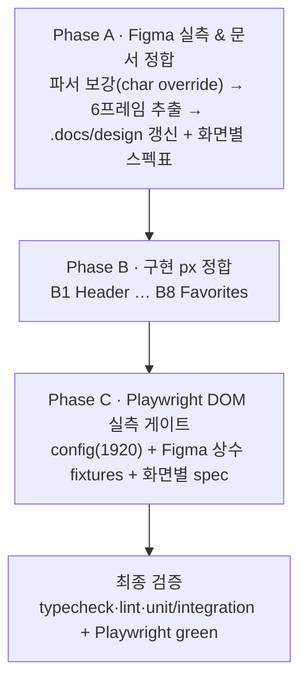

# figma-visual-parity

> 상태: ✅ 완료 (2026-07-09 ship) — Phase A~C 전량 완료, Playwright 7/7 green

## 목표

Figma(파일 `VHM0w7IBWLaaCJp0l9Mkff`, **1920×1080 고정 기준**) 실측을 SOT로 삼아 6개 화면의 px·간격·색·타이포·레이아웃을 근사값→실측값으로 정합시키고, **Playwright DOM 실측 assertion**으로 정합을 회귀 방지 게이트로 잠근다.

## 배경 (3 Whys)

- 왜: "디테일한 부분들이 전부 안 맞는다" — 헤더/팝오버/간격이 매직넘버로 근사돼 있음
- 왜: 과거 세션이 PNG 샘플링·관찰로 근사치를 넣었고 일부는 실측과 어긋남(예: 헤더 탭 gap 32 vs 56, inactive 탭 색)
- 왜: Figma 실측(REST auto-layout gap/padding/좌표)을 요소 단위로 재추출해 코드에 1:1 반영한 적이 없음
- 실제 필요: **Figma 실측 → 문서 정합 → 구현 px 정합 → Playwright로 박제**의 일관 파이프라인

## 요구사항

- WHEN Figma 1920 프레임의 요소 좌표/치수/gap/색/타이포 THEN 구현이 동일 px(±1px)로 렌더
- WHEN 반응형 THEN **미고려** — 1920×1080 단일 기준으로만 정합 (사용자 확정)
- WHEN 기획서(requirements.md) 기능 요구 THEN 시각 정합과 함께 교차 확인(기능 회귀 없음)
- WHEN Playwright 실행 THEN 각 화면 핵심 요소의 computed style이 Figma 실측 상수와 일치(불일치 시 fail)

## 현재 상태

- `.docs/design/{tokens,components,screens}.md` 존재 — 색 9종·타이포 8종은 검증 완료, 그러나 **화면별 요소 px·간격은 부분적/근사**(screens.md "❌ 수정 필요" 4건 명시)
- 구현: 홈(검색) 수직 슬라이스 + 찜 페이지 + 공용 컴포넌트(Button/Input/Dropdown/Search/Toast) 완비. Header는 `mx-[160px] gap-x-[400px] gap-x-8`로 근사
- Playwright: `@playwright/test` 설치만 됨 — **config·spec·script 전무** → 신규 셋업 필요
- Figma 접근: MCP 미연결, REST API + PAT(세션 한정, 파일 저장 금지) — 파서 검증 완료(auto-layout gap/padding/좌표/색/타이포 추출 가능)

## Figma 실측 SOT (Phase 0 추출 — 검증 완료분)

### Header (18:805 기준, 프레임 상대 1920)
| 요소 | 실측 | 현재 구현 | 판정 |
|---|---|---|---|
| 로고 "CERTICOS BOOKS" | 24/700 #353C49, @x160 y24 | `mx-[160px]` title1 | ✅ 좌측 160 |
| 탭 "도서 검색" | 20/500 #353C49, @x767 y27 | body1, gap-x-[400px] | ⚠ x 근사 |
| 탭 "내가 찜한 책" | 20/500 #353C49, @x902 | `gap-x-8`(32px) | ❌ 탭 gap **56px** |
| inactive 탭 색 | #353C49 (양 탭 동일) | `text-subtitle` | ❌ 확인 후 수정 |
| 활성 언더라인 | 1px #4880EE, 탭폭, @y56 | `border-b-2`(2px) | ❌ 1px |

### 검색 영역 (18:805)
| 요소 | 실측 | 판정 |
|---|---|---|
| h1 "도서 검색" | 22/700 #1A1E27, @x480 y160 | ✅ |
| h1→검색행 gap | 16px | ✅ mb-4 |
| 검색 인풋(pill) | 480×50, r100, #F2F4F6, pad[10,0,10,10] gap11 | 확인 |
| placeholder | 16/500 #8D94A0 | ✅ |
| 상세검색 버튼 | 72×35, r8, stroke #8D94A0 1px, pad[5,10,5,10] | 확인 |
| 인풋→상세버튼 gap | 16px | ✅ gap-4 |
| 검색행→카운트 gap | 25px | ⚠ mb-6(24) |

### 카운트 (18:805)
| 요소 | 실측 | 판정 |
|---|---|---|
| "도서 검색 결과" | 16/**500** lh24 #353C49 | 확인 |
| "총 N건" | 16/**400** lh24 #353C49 | ❌ weight 400 |
| 숫자 색 | per-character override 확인 필요(파서 보강) | ⚠ Phase A |
| 라벨 gap | 16px | ✅ |
| 카운트→리스트 gap | 36px | ✅ gap-9 |

### BookListItem collapsed (18:805, 960×100)
| 요소 | 실측 |
|---|---|
| pad-left → 썸네일 | 48px, 썸네일 48×68 |
| 하트 오버레이 | 16×16, 썸네일 우상단 flush |
| 썸네일→제목 gap | 48px |
| 제목/저자 | 18/700 #353C49 / 14/500 #6D7582, gap16, 수직중앙 |
| price | 18/700 #353C49, @x1054 |
| 구매하기 버튼 | 115×48, r8, #4880EE, 16/500 #FFFFFF, pad[13,20,13,20] |
| 상세보기 버튼 | 115×48, r8, #F2F4F6, 16/500 #6D7582 + chevron 14×8 #B1B8C0 |
| 버튼 gap | 8px |
| pad-right | 16px |
| divider | 960×1 #D2D6DA (하단) |

### 상세검색 팝오버 (744:156, 360×160)
| 요소 | 실측 |
|---|---|
| 팝오버 | 360×160, r8, #FFFFFF, pad 좌우24 |
| close 아이콘 | 20×20 @x332 y8 (내부 X 12×12 #B1B8C0) |
| 드롭다운(제목) | **borderless** 100×36, 텍스트 14/**700** #353C49 + chevron 10×6 #B1B8C0, 언더라인 100×1 **#D2D6DA** |
| 검색어 input | 208×36, placeholder 14/500 #8D94A0, 언더라인 208×1 **#4880EE**(primary) |
| 드롭다운↔input gap | 4px, 언더라인 baseline 동일(y71) |
| 검색하기 버튼 | 312×36, r8, #4880EE, 14/500 #FFFFFF |
| 행→버튼 gap | 16px |

> 초기/빈결과(18:969), 찜 목록(744:313), 찜 빈(757:1435), 상세검색 주석(18:608), 전체검색 히스토리(18:495)는 Phase A에서 동일 파서로 추출.

## 다이어그램

---

## 체크리스트

### Phase A: Figma 실측 & 문서 정합 (SOT 확정) ✅

- [x] Step A.1: 파서 보강 — per-char 색 override 파싱. 결과: "총 21건"의 "21"만 `#4880EE`(라벨 `#353C49`) 확정 → **현 구현 이미 정합**
- [x] Step A.2: 6프레임 전량 추출(18:805/18:969/744:313/757:1435/18:608/744:156/18:495) — 배치 페치 + 스크래치패드 캐시
- [x] Step A.3: `tokens.md` — 색 9종·타이포 8종 값 전부 유효 확인, 재실측 노트 추가
- [x] Step A.4: `components.md` — Button/Input/Dropdown(borderless)/Popover/EmptyState 실측 스펙 정정
- [x] Step A.5: `screens.md` — 6화면 "실측 정합 SOT(요소→px)" 재작성. 기능 요구(requirements.md)는 book-search-app에서 구현 완료 — 본 작업은 **시각 전용**(기능 회귀 없음)

### Phase B: 구현 px 정합 (화면별)

- [x] Step B.1: Header — 탭 gap 56px, inactive 탭 색(실측 확정), 언더라인 1px·오프셋, 로고/탭 x좌표 정합(1920 고정, 매직넘버→실측)
  - 검증: DevTools로 x=160/767/902, gap56, underline 1px 확인
- [x] Step B.2: 검색 영역 — 인풋 480×50 pill(pad/gap11), 상세검색 72×35(stroke/pad), h1·간격(16/25) 정합
  - 검증: 각 요소 px 실측 대조
- [x] Step B.3: 카운트 — "총 N건" weight 400, 숫자 색(실측 확정), 라벨 gap16
  - 검증: computed style 대조
- [x] Step B.4: BookListItem collapsed — pad48/썸네일48×68+하트16/gap48/price 18-700/버튼 115×48 gap8/pad-right16/chevron
  - 검증: 아이템 내부 좌표 대조
- [x] Step B.5: BookListItem expanded — 썸네일 210×280+하트24, 원가(취소선)/할인가, 구매 240×48, 소개 라벨/본문
  - 검증: 아코디언 확장 상태 px 대조
- [x] Step B.6: 상세검색 팝오버 — pad24, **드롭다운 borderless+underline** variant, input 언더라인 primary, 검색하기 312×36, close 20×20(X 12×12), 행/버튼 간격
  - 검증: 팝오버 오픈 상태 px 대조 (드롭다운 박스 제거 확인)
- [x] Step B.7: EmptyState — 초기/빈결과 화면 실측 정합(일러스트/문구 크기·위치·간격)
  - 검증: 빈 상태 렌더 대조
- [x] Step B.8: Favorites — 헤더 카운트("찜한 책 총 N건"), 리스트 재사용 정합, 찜 빈 상태
  - 검증: /favorites 렌더 대조

### Phase C: Playwright DOM 실측 정합 게이트

- [x] Step C.1: `playwright.config.ts` 신설 — 1920×1080 뷰포트, `webServer`(pnpm dev:3000), 애니메이션 비활성, fonts ready 대기
  - 검증: `pnpm test:e2e` 부팅 성공
- [x] Step C.2: Figma 상수 fixtures — Phase A 실측값을 `e2e/fixtures/figma-spec.ts`로 상수화 + 카카오 API mock(route intercept, 결정적 도서 데이터)
  - 검증: mock 응답으로 리스트 렌더
- [x] Step C.3: 화면별 spec — header/search/count/booklist(collapsed·expanded)/popover/empty/favorites의 computed style(폭·높이·gap·font·color) assertion(±1~2px 허용)
  - 검증: 각 spec 통과, 불일치는 Phase B로 되돌려 수정
- [x] Step C.4: `package.json` script(`test:e2e`) + 실행/수정 루프 — green까지
  - 검증: 전체 spec green

### 최종 검증 ✅

- [x] pnpm check-types — 통과
- [x] pnpm lint — 0 errors (기존 useBookListVirtualizer 경고 1건만)
- [x] pnpm test:unit && pnpm test:integration — unit 0(파일 없음)/integration 9 통과
- [x] pnpm test:e2e — **7/7 통과**(Playwright 1920 DOM 실측, 실브라우저 렌더 검증 포함)

---

## 수정 파일 목록

| 파일 | 작업 |
|---|---|
| `.docs/design/tokens.md` | 수정(실측 정정) |
| `.docs/design/components.md` | 수정(컴포넌트 실측 스펙) |
| `.docs/design/screens.md` | 수정(6화면 정합 스펙표) |
| `src/layouts/component/Header.tsx` | 수정(탭 gap/색/언더라인/좌표) |
| `src/pages/home/styles/HomePage.style.ts` | 수정(간격/카운트) |
| `src/pages/home/HomePage.tsx` | 수정(카운트 weight/색 마크업) |
| `src/pages/home/components/BookListItem.tsx` + `styles/BookListItem.style.ts`(신규 분리 가능) | 수정 |
| `src/pages/home/styles/DetailSearchPopover.style.ts` + `DetailSearchPopover.tsx` | 수정(팝오버 정합) |
| `src/components/dropdown/*` | 수정(borderless+underline variant — 팝오버용) |
| `src/components/button/Button.style.ts` | 수정(size/padding 실측 정합) |
| `src/components/input/**`, `search/**` | 수정(pill/underline 실측) |
| `src/pages/home/components/EmptyState.tsx` + style | 수정 |
| `src/pages/favorites/**` | 수정(카운트/리스트/빈상태) |
| `src/assets/icons/close.svg` | 조정(20/12 사이즈 반영) |
| `playwright.config.ts` | 신규 |
| `e2e/fixtures/figma-spec.ts`, `e2e/*.spec.ts` | 신규 |
| `package.json` | 수정(test:e2e script) |

## 실패 위험 (Pre-mortem)

- [ ] Figma API rate-limit(과거 발생) → Phase A에서 배치 페치 + 스크래치패드 캐시, 재페치 최소화
- [ ] PAT 만료(~2026-07-14 추정) → **Phase A에서 필요한 추출을 앞당겨 일괄 완료**
- [ ] 파서가 per-character 색 override 누락(카운트 숫자) → Step A.1에서 파싱 보강 후 색 확정
- [ ] 1920 고정 전환 시 기존 반응형 유틸(max-w/mx-auto) 제거로 레이아웃 붕괴 → 콘텐츠 960 중앙(left480@1920) 정확 복제, 헤더 풀폭+고정 인셋
- [ ] Playwright flaky(폰트/API/애니메이션) → 카카오 API mock + fonts ready 대기 + 애니메이션 비활성 + ±1~2px 허용
- [ ] 가상 스크롤(react-virtual) 절대배치 → 첫 렌더 아이템 기준 측정, transform 고려
- [ ] 스코프 인플레이션("모든 시각") → 6프레임에 명시된 요소로 한정, 미명시(히스토리 등)는 동작만

## 결정 사항

- Phase 0 Clarify 결과: **1920×1080 고정 기준, 반응형 미고려**(사용자) / Playwright는 **DOM 실측 assertion**(사용자)
- Figma는 SOT, `.docs/design`은 중간 SOT — 실측이 문서와 다르면 문서를 실측으로 갱신 후 구현 정합
- PAT는 세션에만 존재 — 파일/커밋/메모리 저장 금지(Figma 접근 방침)

## 발견 사항 / backlog

→ `.docs/plans/figma-visual-parity.backlog.md` (짝 원장)

## 컨벤션 변경 필요

- (Phase 진행 중 새 패턴 발견 시 기록 → /review에서 반영 판단) 후보: 드롭다운 borderless+underline variant 승격, Playwright DOM 정합 테스트 패턴 룰화
