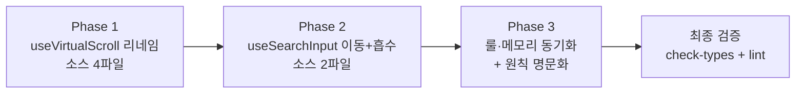

# hooks-restructure — 공통 훅 레이어 정리

> 상태: 🟡 구현+검증 완료 · **ship 보류** (병렬 test-strategy 세션과 워킹트리 얽힘 — 둘 다 준비되면 통합 ship) · `book-search-app.md`에서 분리(🔀, 사용자 "새 플래닝" 명시)
>
> 검증(2026-07-09): grep 게이트 0건 · check-types 통과 · lint 0 errors(4 warnings 전부 병렬세션/기존) · test:unit 19/19. 잔여: Step 3.3(메모리)·브라우저 스모크는 통합 ship 시.

## 목표

`src/hooks/`를 "도메인 제네릭 훅"만 남기도록 정리한다 — 페이지 전용 훅은 페이지 슬라이스로 내리고, 도메인명이 박힌 범용 훅은 범용 이름으로 리네임한다.

## 배경 (Why)

- 왜: 사용자 코드 피드백 — `src/hooks/`는 "재사용 가능한 공통 훅"의 정의인데 현재 그 원칙이 흔들림.
- 왜: `useBookListVirtualizer`는 react-virtual 래퍼(범용)인데 이름이 도메인(book list)에 묶여 "어디서든 가져다쓸" 신호를 못 줌.
- 왜: `useSearchInput`은 home 전용 + anemic(useState 3개만, 로직은 SearchField에 흩어짐)인데 공통 폴더에 있음.
- 실제 필요: **배치 기준을 "현재 사용처 수"가 아니라 "도메인 제네릭성"으로 명문화**하고, 그 기준대로 2건(리네임·이동)을 실행.

## 결정 사항 (확정)

- **원칙 (2단계 판정)** — F-8/F-9로 진화:
  - ① **제네릭 메커니즘인가?**(도메인 무지, 아무 앱에 복붙 가능) → `src/hooks/`. 사용처 1곳이어도 여기. [`useOutsideClick`·`useVirtualScroll`·`useCollapse`]
  - ② **도메인 훅이면 소유자로**: 단일 라우트 → 페이지 슬라이스 `hooks/`; 진짜 라우트간 공유 → 도메인 모듈(`src/lib/{domain}/`).
  - **localStorage 사용은 공통 근거가 아니다** — 구현 디테일. 도메인 소유권이 배치를 정한다.
- **`useOutsideClick` / `useVirtualScroll` / `useCollapse` → `src/hooks/` 유지** — 진짜 제네릭 프리미티브.
- **`useBookListVirtualizer` → `useVirtualScroll` 리네임** — `estimateSize` 옵셔널 파라미터(기본 100)로 범용화.
- **`useSearchInput` → `src/pages/home/hooks/` 이동 + 로직 흡수** — home 검색창 도메인, 단일 소유. (useHome 흡수는 입력버퍼 Context 격리 위반이라 제외)
- **`useSearchHistory` → `src/pages/home/hooks/` 이동** (F-7) — 검색기록 도메인, home 단일 소유. 단일 파일 유지(도메인 모듈 분할 불필요).
- **`useFavorites` → `src/lib/favorites/` 도메인 모듈 2파일** (F-8/F-9) — 진짜 2라우트 공유. `favorites.ts`(순수 도메인) + `useFavorites.ts`(얇은 상태 훅). books `api.ts`+`api.queries.ts`와 동형(찜 = 서버 없는 로컬 백엔드 도메인).

## 현재 상태 (분석) — 재정립 후

| 훅 | 사용처 | 판정 |
|---|---|---|
| `useOutsideClick` | home/DetailSearchPopover | 유지 (제네릭 → src/hooks) |
| `useVirtualScroll` (구 `useBookListVirtualizer`) | home, favorites × 2 | 리네임 (제네릭 → src/hooks) |
| `useCollapse` | home, favorites | 유지 (제네릭 → src/hooks) |
| `useSearchInput` | home/SearchField | 이동+흡수 → `pages/home/hooks/` |
| `useSearchHistory` | home/useHome | 이동 → `pages/home/hooks/` |
| `useFavorites` | home/useHome, favorites × 3 | 도메인 모듈화 → `src/lib/favorites/`(순수+훅) |

## 다이어그램

---

## 체크리스트

### Phase 1: `useBookListVirtualizer` → `useVirtualScroll` 리네임

- [x] Step 1.1: 훅 파일 리네임 + export명 변경 + `estimateSize` 파라미터화
  - 작업: `git mv src/hooks/useBookListVirtualizer.ts src/hooks/useVirtualScroll.ts`. `export const useVirtualScroll`. 시그니처에 `estimateSize?: number`(기본 100) 추가 — 기존 하드코딩 `() => 100` 대체(동작 불변). 상단 주석의 "도서 결과" 표현을 도메인 중립으로 다듬기.
  - 검증: `pnpm check-types`
- [x] Step 1.2: 소비처 import·호출 교체 (3곳)
  - 작업: `HomePage.tsx`, `FavoritesPage.tsx` import 경로+훅명 교체, `useFavoritesPage.ts:30` 주석의 훅명 교체. `@/hooks/useVirtualScroll`.
  - 검증: `grep -rn useBookListVirtualizer src` → 0건, `pnpm check-types`

### Phase 2: `useSearchInput` 이동 + 로직 흡수

- [x] Step 2.1: 훅을 페이지 슬라이스로 이동 + enrich
  - 작업: `src/pages/home/hooks/useSearchInput.ts` 신설(구 `src/hooks/useSearchInput.ts` 삭제). 파라미터 객체 `{ initialValue, historyList, onSearch, onSelectHistory }` 수용. 훅이 소유: `draft`/`isFocused`/`activeIndex` state + `isHistoryOpen`(파생) + `selectHistory` + 입력 핸들러(onChange/onKeyDown ↑↓·Esc/onEnter/onFocus/onBlur). 반환은 `draft`, `activeIndex`, `isHistoryOpen`, `selectHistory`, 입력 핸들러 묶음.
  - 검증: `pnpm check-types`
- [x] Step 2.2: `SearchField.tsx` 얇게 — 로직 제거, 바인딩만
  - 작업: import 경로를 `../hooks/useSearchInput`로. 컴포넌트 내부의 `selectHistory`/`onChange`/`onKeyDown`/`onEnter`/`onBlur` 로직을 전부 훅으로 이관, SearchField는 훅 반환값을 `<Search>`·`<SearchHistoryList>`에 바인딩만. JSX props 순서 규약 유지(명시 바인딩, 무분별 spread 지양).
  - 검증: `grep -rn "@/hooks/useSearchInput" src` → 0건, `pnpm check-types && pnpm lint`

### Phase 3: 룰·메모리 동기화 + 원칙 명문화

- [x] Step 3.1: 룰 문서 훅명·시그니처 갱신
  - 작업: `react.md`(31/305/514/516), `anti-patterns.md`(726/730), `animation.md`(16)의 `useBookListVirtualizer`→`useVirtualScroll`, `useSearchInput` 시그니처 예시 갱신.
  - 검증: `grep -rn useBookListVirtualizer .claude` → 0건
- [x] Step 3.2: 배치 원칙 명문화 (💡 후보 → 룰 반영은 /review에서 확정)
  - 작업: `react.md` "컴포넌트 무상태 원칙" 인접에 "src/hooks(제네릭) vs page/hooks(페이지 전용)" 기준 1문단 추가 제안. `useSearchInput`을 "page-local dedicated 훅" 예로, `useOutsideClick`/`useVirtualScroll`/`useCollapse`를 "제네릭 공통 훅" 예로 구분.
  - 검증: 문장 정합성 리뷰
- [ ] Step 3.3: 메모리 handoff 갱신
  - 작업: `project-cdri-handoff-state.md`의 훅명·경로 갱신(ship 시점).

### Phase 4: `useFavorites` 도메인 모듈화 (`src/lib/favorites/`) — F-8/F-9

- [x] Step 4.1: `src/lib/favorites/favorites.ts` 신설 (순수 도메인)
  - 작업: `FavoriteBook` 타입 + `toFavoriteBook`(스냅샷) + 순수 함수 `readFavorites`/`writeFavorites`/`isFavorite(list,isbn)`/`toggleFavorite(list,book)`. React 무관. localStorage 접근은 `@/utils/localStorage` 재사용(window 가드 유지).
  - 검증: `pnpm check-types`
- [x] Step 4.2: `src/lib/favorites/useFavorites.ts` 신설 + 구 파일 삭제
  - 작업: 얇은 상태 훅 — `useState(readFavorites)` + `favoriteHandler{isFavorite, toggle}`가 순수 함수 위임(`setFavorites(next); writeFavorites(next)`). 반환 `{ favorites, favoriteHandler }`(계약 불변). `git rm src/hooks/useFavorites.ts`.
  - 검증: `pnpm check-types`
- [x] Step 4.3: 소비처 import 교체 (4곳)
  - 작업: `useHome.ts`·`useFavoritesPage.ts`의 `@/hooks/useFavorites` → `@/lib/favorites/useFavorites`. `FavoriteBookItem.tsx`의 `FavoriteBook` 타입 → `@/lib/favorites/favorites`.
  - 검증: `grep -rn "@/hooks/useFavorites" src` → 0건, `pnpm check-types`

### Phase 5: `useSearchHistory` home 이동 — F-7

- [x] Step 5.1: `src/pages/home/hooks/useSearchHistory.ts`로 이동
  - 작업: `git mv src/hooks/useSearchHistory.ts src/pages/home/hooks/useSearchHistory.ts`(내용 불변). `useHome.ts` import를 `@/hooks/useSearchHistory` → `./useSearchHistory`.
  - 검증: `grep -rn "@/hooks/useSearchHistory" src` → 0건, `pnpm check-types`

### Phase 6: 배치 원칙 재정리 + 상위 문서 동기화 — F-8

- [x] Step 6.1: `react.md`(306) 배치 원칙 문단을 **2단계 판정**으로 재작성 (기존 "제네릭성" 단일축 → 제네릭 프리미티브 / 도메인훅→소유자). `useFavorites`=lib/favorites 도메인 모듈, `useSearchHistory`=home 예로 교정.
  - 검증: 문장 정합성 + `src/hooks/` 서술이 현 구조와 일치
- [x] Step 6.2: `CLAUDE.md`(49) "공통 훅" 서술 갱신 — src/hooks=제네릭 프리미티브, 찜=src/lib/favorites, 검색기록·검색입력=pages/home/hooks.
  - 검증: 서술이 실제 트리와 일치
- [x] Step 6.3: `requirements.md`(43/100) 살아있는 AC의 `useBookListVirtualizer`→`useVirtualScroll` 갱신 (SOT 정확성). 이력 원장(backlog F-17/H-10)·completed/·book-search-app.md는 미수정(이력 보존).
  - 검증: `grep -rn useBookListVirtualizer .docs/spec` → 0건

### Phase 7: 검색 UX 후속 (동작/디자인 피드백 F-11~14) — ⚠️ 순수 리팩토링과 달리 **동작 변경** 포함

- [x] Step 7.1: (#2·F-12 버그) 새 검색 시 스크롤 top 초기화 — **`BookResultList`를 검색키(`${filters.q}|${filters.target}`)로 `key` 재마운트**. ⚠️ 명령형 초기화(`scrollTo(0)`/`scrollToOffset(0)`)는 **실패**: 새 검색 시 `isFetched` 게이트로 결과 섹션이 언마운트→리마운트되고 persistent virtualizer가 이전 offset(예:800)을 새 엘리먼트에 **복원**함. → virtualizer 자체를 새로 만드는 `key` 재마운트가 정답(Playwright로 확인). `useVirtualScroll`은 순수 복귀(resetKey 제거).
- [x] Step 7.2: (#1·F-11) `useSearchInput.onEnter` — 검색 실행 후 `inputRef.blur()`로 히스토리 popover 닫기.
- [x] Step 7.3: (#3·F-13) `useSearchInput.onKeyDown` Esc — `preventDefault()`(네이티브 값삭제 차단) + popover만 닫고 값 보존. Esc 처리를 isHistoryOpen 가드 앞으로 이동.
- [x] Step 7.4: (#4·F-14) `Search.style` `[&::-webkit-search-cancel-button]:hidden` + SearchField가 값 있을 때 close.svg(#B1B8C0) suffix clear 버튼(clear→값 비우고 focus 유지, inputRef 소유는 useSearchInput).
  - 검증(공통): check-types 통과 · lint 신규 경고 0 · test:unit 26/26 · **Playwright `e2e/search-ux.spec.ts` 4/4 통과**(신규 스펙 — #1 enter→popover닫힘 / #2 새검색 스크롤 top / #3 Esc 값보존 / #4 clear close.svg)

### 최종 검증

- [x] `pnpm check-types`
- [x] `pnpm lint` (신규 경고 0)
- [x] `pnpm test:unit` 26/26
- [x] **Playwright** `e2e/search-ux.spec.ts` 4/4 (검색 UX 동작 실브라우저 검증 완료)

---

## 수정 파일 목록

| 파일 | 작업 |
|---|---|
| `src/hooks/useBookListVirtualizer.ts` → `src/hooks/useVirtualScroll.ts` | 리네임 + 파라미터화 |
| `src/hooks/useSearchInput.ts` | 삭제 (→ 이동) |
| `src/pages/home/hooks/useSearchInput.ts` | 신규 (이동 + enrich) |
| `src/pages/home/HomePage.tsx` | import/훅명 교체 |
| `src/pages/favorites/FavoritesPage.tsx` | import/훅명 교체 |
| `src/pages/favorites/hooks/useFavoritesPage.ts` | 주석 훅명 교체 |
| `src/pages/home/components/SearchField.tsx` | import 경로 + 로직 이관 + clear 버튼 suffix(Phase 7) |
| `src/pages/home/styles/SearchField.style.ts` | `clear` 슬롯 추가 (Phase 7) |
| `src/components/input/search/Search.style.ts` | 네이티브 search-cancel 버튼 숨김 (Phase 7) |
| `src/pages/home/HomePage.tsx` (Phase 7) | `BookResultList` 추출 + 검색키 `key` 재마운트(스크롤 리셋) |
| `e2e/search-ux.spec.ts` | 신규 — 검색 UX 동작 Playwright 4건 |
| `src/lib/favorites/favorites.ts` | 신규 (순수 도메인 — 타입+매핑+read/write/toggle/isFavorite) |
| `src/lib/favorites/useFavorites.ts` | 신규 (얇은 상태 훅) |
| `src/hooks/useFavorites.ts` | 삭제 (→ lib/favorites 분할) |
| `src/hooks/useSearchHistory.ts` → `src/pages/home/hooks/useSearchHistory.ts` | 이동 (home 전용) |
| `src/pages/home/hooks/useHome.ts` | useFavorites/useSearchHistory import 경로 교체 |
| `src/pages/favorites/hooks/useFavoritesPage.ts` | useFavorites import 경로 교체 |
| `src/pages/favorites/components/FavoriteBookItem.tsx` | FavoriteBook 타입 import 경로 교체 |
| `.claude/rules/react.md` | 훅명·배치 원칙(2단계 판정) 갱신 |
| `.claude/rules/anti-patterns.md` | 훅명·시그니처 예시 갱신 |
| `.claude/rules/animation.md` | 훅명 갱신 |
| `CLAUDE.md` | "공통 훅" 서술 갱신 (49) |
| `.docs/spec/requirements.md` | 살아있는 AC 훅명 갱신 (43/100) |
| `memory/project-cdri-handoff-state.md` | 훅명·경로 갱신 (ship) |

## 실패 위험 (Pre-mortem)

- [ ] 리네임 누락으로 dead import — `grep` 게이트(Step 1.2/3.1)로 0건 확인.
- [ ] `useSearchInput` 흡수 시 key 리셋 회귀 — HomePage `<SearchField key={filters.target}>` + `initialValue={filters.target ? "" : filters.q}` 파라미터 계약 유지 확인.
- [ ] onEnter/키보드 네비 동작 회귀(활성 인덱스 선택 vs 새 검색) — 흡수 후 브라우저 스모크(ship).
- [ ] `onMouseDown preventDefault`(blur보다 클릭 우선) 로직은 SearchHistoryList JSX에 잔존 — 훅 이관 대상 아님(주의).

## 발견 사항 / backlog

→ `.docs/plans/hooks-restructure.backlog.md`

## 컨벤션 변경 필요

- 💡 `src/hooks` vs `page/hooks` 배치 기준 명문화 (Step 3.2) — /review에서 룰 반영 확정.
