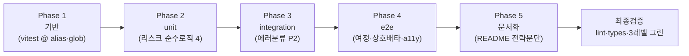

# test-strategy

> 상태: 🔵 진행 중

## 목표

커버리지 숫자가 아니라 **리스크 기반**으로 unit/integration/e2e 3레벨 테스트를 배치하고, "왜 이걸 테스트했는가"의 판단을 README에 명문화한다.

## 배경 (3 Whys)

- 왜 테스트를 다시 정리하나: 현재 테스트가 "의미있는지 보여주기인지" 불확실 (사용자 문제 제기)
- 왜 불확실한가: 기준이 **커버리지**(스펙 전수)로 암묵 설정 → 저가치 테스트까지 끌어들여 끝이 없음
- 왜 그게 문제인가: 과제의 테스트는 커버리지 숫자가 아니라 **"뭘 테스트할 가치가 있는지 아는가"(판단력)**로 평가됨
- 실제 필요: **틀렸을 때 비용이 크고 로직이 비자명한 지점만** 3레벨에 대표 배치 + 판단 근거 문서화

## 요구사항 (스펙 AC 추적)

리스크 기반으로 선별한 테스트만 스펙 AC에 매핑한다. 나머지 AC는 저가치(라이브러리 책임·trivial glue)로 판단해 의도적 제외.

- WHEN 검색기록에 중복 검색어 추가 THEN 기존 제거 후 최신순 맨 앞, 최대 8개 (AC 1.2 · unit)
- WHEN 빈/공백 검색어 추가 THEN 무시 (AC 1.5 · unit)
- WHEN 하트 토글 THEN 클릭 시점 스냅샷 저장(렌더 필드만 큐레이션) (AC 4.1 · unit)
- WHEN IME 한글 조합 중 Enter THEN 검색 미실행 / 조합 종료 후 Enter THEN 실행 (7-11 · unit)
- WHEN sale_price === -1 THEN 원가 표시(할인가 미노출) / 양수 THEN 할인가 (AC 2.5 · unit)
- WHEN 무한스크롤 is_end=true THEN 추가 요청 없음 (AC 2.1 · integration · **이미 있음**)
- WHEN target 파라미터 지정 THEN 쿼리스트링 전달 (AC 3.2 · integration · **이미 있음**)
- WHEN HTTP 401/403/404/503/5xx THEN critical(→/error), 그 외 THEN recoverable(toast) (7-3 · integration · P2)
- WHEN 검색→결과→하트→찜페이지 THEN 찜한 책 유지 (AC 1.1+2.3+4.2 · e2e)
- WHEN 상세검색 실행 THEN 통합 입력 초기화 / 통합검색 THEN 상세 조건 초기화 (AC 3.4 · e2e)
- WHEN 팝오버 열림 THEN role=dialog + Esc 닫힘 · 하트 aria-pressed 상태 반영 (7-9 · e2e · Lighthouse 미포착 행동만)

**의도적 제외(문서화 대상)**: `toComma`(toLocaleString 한 줄 = 비자명 로직 아님) · presentational 컴포넌트 렌더 · tv 슬롯 · nuqs URL 동기화 메커니즘(라이브러리 책임).

## 현재 상태

| 레벨 | 파일 | 진단 |
|---|---|---|
| unit | 0개 (config만 준비, `passWithNoTests`) | ❌ 피라미드 공백 |
| integration | `books.integration`(4) · `books-query.integration`(2) | ✅ 핵심 리스크 명중(API 계약·무한스크롤 종료·enabled 게이트) |
| e2e | `home.spec`·`favorites.spec` | ⚠️ **전부 시각정합** — 기능 여정·상호배타·접근성 행동 공백 |

**차단 이슈**: `vitest.unit/integration.config.ts`에 `@` alias 없음(`vite.config`에만 존재) → 소스가 `@/...`를 쓰므로 co-location unit 테스트 import 실패. Phase 1에서 선제 해결.

**폴더 관례 결론**: e2e가 `src` 형제 = 표준(유지). unit은 **co-location**(`Foo.test.ts` 소스 옆 — 모듈 계약 인접), integration은 **중앙집중 유지**(`src/__tests__/integration/` — 여러 모듈+MSW seam, 소속 모듈 없음).

## 다이어그램

---

## 체크리스트

### Phase 1: 기반 (테스트 인프라)

- [x] Step 1.1: vitest config에 `@` alias 추가
  - 작업: `vitest.unit.config.ts`·`vitest.integration.config.ts`에 `resolve.alias { "@": path.resolve(__dirname, "./src") }` (vite.config와 동일)
  - 검증: ✅ integration 9건 그린(회귀 0)
- [x] Step 1.2: unit config를 co-location glob으로 전환
  - 작업: `include: ["src/**/*.test.{ts,tsx}"]` + `exclude: [...configDefaults.exclude, "**/*.integration.test.*"]`
  - 검증: ✅ `pnpm test:unit` 시 integration 미수집(exclude 확인), passWithNoTests

### Phase 2: unit (리스크 순수 로직 — co-location)

> ⚠️ 세션 중 동시 진행된 hooks-restructure가 대상 훅을 이동시킴(발견 F-5). 최종 경로 반영.

- [x] Step 2.1: `src/pages/home/hooks/useSearchHistory.test.ts` (AC 1.2·1.5)
  - 작업: 중복→최신순 재정렬, 최대 8 유지, 빈/공백 무시(add guard), remove. `renderHook` + localStorage 반영
  - 검증: ✅ 5건 그린 (파일은 restructure가 home 슬라이스로 이동시킴)
- [x] Step 2.2: `src/lib/favorites/favorites.test.ts` (AC 4.1) — **순수 함수로 retarget**
  - 작업: restructure가 찜 도메인 로직을 순수 `favorites.ts`로 추출 → 훅 대신 `toggleFavorite`/`isFavorite` 직접 테스트. **스냅샷 큐레이션**(잉여 필드 제거) · 토글 add/remove · 최신순
  - 검증: ✅ 4건 그린. 훅 배선 중복 테스트(`useFavorites.test.ts`)는 제거(trivial wiring)
- [x] Step 2.3: `src/components/input/hooks/useInput.test.ts` (7-11 IME)
  - 작업: 조합 확정 Enter(`nativeEvent.isComposing`)·조합중(ref) Enter → `onEnter` 미호출 / 종료 후 Enter → 호출 / 非Enter 미호출
  - 검증: ✅ 4건 그린
- [x] Step 2.4: 가격 규칙 순수 함수 추출 `src/utils/price.ts` + `price.test.ts` (AC 2.5)
  - 작업: `BookListItem`·`FavoriteBookItem` 중복 인라인(`sale_price >= 0 ? …`)을 `resolveBookPrice`로 추출 → 두 호출처 교체 → unit(−1→원가, 양수→할인가, 0 경계). **순수 이동(렌더 불변)**
  - 검증: ✅ 3건 그린 + 타입체크 그린(가격 표시 로직 동일)

### Phase 3: integration (에러 분류 — P2, 여유 시)

- [x] Step 3.1: 에러 분류 순수 함수 추출 + unit (7-3)
  - 작업: `queryClient.ts` onError 인라인 분류를 `src/lib/api/shared/classifyQueryError.ts` 순수 함수로 추출(navigate/toast 디스패치는 onError 잔류) → unit(401/403/404/503/5xx=critical, 400/429/네트워크/非axios=recoverable)
  - 검증: ✅ unit 10건 그린 + 타입체크 그린(onError 얇은 디스패처로 정리, axios import 제거)

### Phase 4: e2e (기능 트랙 — 시각정합 유지 + 신규)

> `e2e/journey.spec.ts` 단일 파일에 3 test로 통합(시각정합 spec과 트랙 분리).

- [x] Step 4.1: 검색→결과→찜 여정 (AC 1.1+2.3+4.2)
  - 작업: `mockBookApi` → `/?q=` → 결과 렌더 → 하트 클릭(`aria-pressed` false→true + 라벨 토글) → `/favorites` → 스냅샷 유지 + 카운트 1
  - 검증: ✅ 그린
- [x] Step 4.2: 상호배타 (AC 3.4)
  - 작업: 상세검색 실행 → 통합 입력 `""` + URL `target=title` / 통합검색 실행 → `target=` 제거
  - 검증: ✅ 입력 버퍼·URL assert 그린
- [x] Step 4.3: 접근성 행동 (7-9 — Lighthouse 미포착만)
  - 작업: 팝오버 `role="dialog"` + 닫기 버튼 dismiss (하트 aria-pressed는 4.1에 병합)
  - 검증: ✅ 그린. 전체 e2e 10건 회귀 0 (Lighthouse a11y는 `/review-ui`가 별도 커버)

### Phase 5: 문서화 — ⏸️ 보류 (다음 플래닝)

> README.md 미존재 발견. 전체 README(라이브러리 선택 이유·트레이드오프·실행법·Lighthouse·AI 협업)는 별도 큰 산출물이라 이 plan 범위 초과(Surgical). 테스트 전략 문단은 README 작성 플래닝에 편입. (F-6)

- [ ] Step 5.1: (보류) README "테스트 전략" 문단
  - 작업: 커버리지 비목표 + 리스크 지점(검색기록·찜 스냅샷·무한스크롤 종료·상호배타·IME·가격 센티넬·에러분류) + 3레벨 책임 분리 + **의도적 제외 근거**(toComma 등) 명시
  - 검증: 문단이 실제 테스트 파일과 1:1 일치

### Phase 7: 테스트 구조 co-location 통일 — ✅ 완료 (2026-07-09)

> 결정(F-11): unit은 이미 co-location, e2e는 분리(표준) — integration만 `__tests__` 중앙집중이라 튄다. integration을 도메인 옆으로 내려 "테스트는 대상 옆" 한 규칙으로 통일.

- [x] Step 7.1: integration 테스트 co-locate (`git mv` 히스토리 보존)
  - → `src/lib/api/books/api.integration.test.ts` (import `./api`·`@/test/msw-server`)
  - → `src/lib/api/books/api.queries.integration.test.tsx` (import `./api.queries`·`@/test/msw-server`)
- [x] Step 7.2: 공유 MSW 인프라 → `src/test/`
  - `src/test/msw-server.ts` · `src/test/integration-setup.ts`(import `./msw-server`)
- [x] Step 7.3: config + 폴더 정리
  - `vitest.integration.config.ts`: include `src/**/*.integration.test.{ts,tsx}`, setupFiles `./src/test/integration-setup.ts`
  - `src/__tests__/` 삭제(빈 `unit/` 스캐폴딩 잔재 포함)
  - **추가**(F-12): `test-impact.mjs`가 `.mjs`라 eslint 브라우저 globals 블록 밖 → node `console`/`process` no-undef 에러. `.claude/**`를 eslint ignore에 추가(하네스는 앱 lint 대상 아님)
  - 검증: ✅ integration 9 그린(새 경로) · unit 26(integration 미수집) · typecheck 통과 · lint 0 errors · 게이트 OK. 잔여 warning 3건은 왼쪽 세션 파일(`useVirtualScroll`·`DetailSearchPopover.style`) — 소관 외

### Phase 6: 왼쪽 세션(hooks-restructure) 종료 후 테스트 재점검 — ✅ 완료 (위 재점검 참조)

> 동시 진행 중인 hooks-restructure가 소스를 계속 이동/수정 중. 그 세션이 끝나면 테스트가 여전히 올바른 대상을 겨냥하는지 재점검. (F-7)

- [x] Step 6.1: 재점검 (hooks-restructure 종료 후, 2026-07-09)
  - 작업: 최종 diff 확인 → 회귀 1건 수정
    - **e2e journey 상호배타 실패**: 왼쪽 세션이 검색 clear 버튼(`aria-label="검색어 지우기"`) 추가 → `getByLabel("검색어")` substring 매칭이 input+clear 2개를 잡아 strict 위반. → `getByRole("searchbox", { name: "검색어" })`로 교체(search-ux.spec와 셀렉터 일관)
    - unit 대상 시그니처 전부 유효(favorites 순수함수·useSearchHistory·useInput·price·classifyQueryError 그대로) → 갱신 불필요
    - 추출 함수 2건(`resolveBookPrice`×2·`classifyQueryError`) 소스 사용처 유지 확인
    - 왼쪽 세션 추가분 `e2e/search-ux.spec.ts`(검색 UX #1~4)는 journey와 상보적, 중복 없음
  - 검증: ✅ unit 26 · integration 9 · e2e 14 · typecheck 통과 · lint 0 errors(내 테스트 파일 import 순서 fix, 잔여 경고 1건은 왼쪽 세션 `useVirtualScroll.ts` — 소관 외)

### 최종 검증

- [ ] `pnpm lint && pnpm check-types`
- [ ] `pnpm test:unit && pnpm test:integration && pnpm test:e2e` 전부 그린
- [ ] describe/it 문자열이 "검증 대상(무엇)"만 담고 과정 서사 없음 (conventions "소스 주석 최소화" 준수)

---

## 수정 파일 목록

| 파일 | 작업 |
|---|---|
| `vitest.unit.config.ts` | 수정 (@ alias + co-location glob) |
| `vitest.integration.config.ts` | 수정 (@ alias) |
| `src/hooks/useSearchHistory.test.ts` | 신규 (U1) |
| `src/hooks/useFavorites.test.ts` | 신규 (U2) |
| `src/components/input/hooks/useInput.test.ts` | 신규 (U3) |
| `src/utils/price.ts` (또는 적정 위치) | 신규 순수함수 `resolveDisplayPrice` |
| `src/utils/price.test.ts` | 신규 (U4) |
| `src/pages/home/components/BookListItem.tsx` | 수정 (인라인→순수함수) |
| `src/pages/favorites/components/FavoriteBookItem.tsx` | 수정 (인라인→순수함수) |
| `src/lib/api/shared/classifyQueryError.ts` | 신규 순수함수 (P2) |
| `src/lib/api/shared/classifyQueryError.test.ts` | 신규 (P2) |
| `src/lib/api/queryClient.ts` | 수정 (분류→순수함수 소비, P2) |
| `e2e/journey.spec.ts` | 신규 (E1+E2+E3) |
| `README.md` | 테스트 전략 문단 |

## 실패 위험 (Pre-mortem)

- [ ] vitest `@` alias 누락 → 모든 co-location unit import 실패 (Phase 1 선제)
- [ ] co-location glob이 `*.integration.test.*`를 unit runner로 흡수 → exclude 필수 검증
- [ ] `resolveDisplayPrice`/`classifyQueryError` 추출이 렌더·동작 변경 → **순수 이동만**, 기존 e2e 시각정합/수동확인으로 회귀 감지
- [ ] useInput IME: jsdom에서 `nativeEvent.isComposing` 시뮬레이션 난이도 → `compositionStart`→`keyDown(isComposing:true)` 이벤트 순서 재현
- [ ] 리팩토링 2건(가격·에러분류)이 "테스트 위한 과 엔지니어링"으로 비칠 위험 → 가격은 **중복 제거(DRY)**, 에러분류는 **P2·순수분류만**으로 정당화 범위 한정

## 결정 사항

- 투자 범위: **리스크 집중 + 3레벨 대표** (사용자 승인 2026-07-09)
- unit 위치: **co-location** (모듈 계약 인접, 소스 옆 `Foo.test.ts`)
- integration 위치: **중앙집중 유지** (`src/__tests__/integration/`)
- `toComma` 테스트 **제외**: `toLocaleString` 한 줄 = 비자명 로직 아님 — 제외 자체가 리스크 기반 판단의 시연
- 에러 분류: **순수 함수 추출(b)** 채택 — router 싱글톤 목킹 회피 + 관심사 분리 (P2)
- 가격 규칙: 2곳 중복 → **순수 함수 추출**(DRY + 테스트 가능화, 렌더 불변)

## 발견 사항 / backlog

→ `.docs/plans/test-strategy.backlog.md` (짝 원장)

## 컨벤션 변경 필요

- (Phase 진행 중 발견 시 기록 — 예: 테스트 파일 네이밍 규약 `*.test.ts`(unit)/`*.integration.test.ts`(integration)/`*.spec.ts`(e2e) 3분 규약을 conventions.md에 승격 후보)
