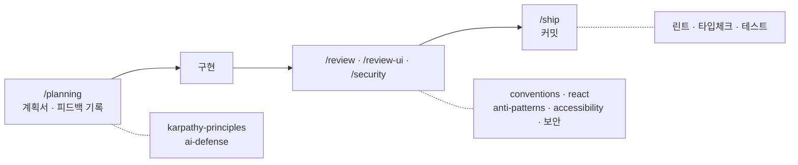

# PROCESS — Claude를 활용한 작업 과정

README의 "Claude 활용"을 조금 더 풀어 쓴 문서입니다. 완성된 코드가 아니라 그 코드를 만든 과정을 담았습니다.

## 작업 순서

`/planning`으로 시작해 `/review`를 거쳐 `/ship`으로 끝나는 흐름입니다. 각 단계는 정해진 규칙을 바탕으로 움직입니다.

1. **계획 (`/planning`)** — 무엇을 어떻게 만들지 먼저 정리하고, 받은 피드백을 함께 기록했습니다. 계획서와 피드백 기록을 한 쌍으로 두었습니다.
2. **구현** — 규모가 작아 한 세션에서 직접 만들었습니다. 리뷰를 객관적으로 받고 싶을 때만 읽기 전용 리뷰어를 따로 두었습니다.
3. **리뷰 (`/review`, `/review-ui`, `/security`)** — 바뀐 코드를 컨벤션·보안·접근성 기준으로 확인했습니다. 화면이 바뀌면 Lighthouse까지 확인했습니다.
4. **커밋 (`/ship`)** — 린트·타입체크·테스트를 통과한 뒤 커밋하고, 끝난 계획서는 완료 폴더로 옮겼습니다.

각 단계에서 파일을 편집하면, 그 파일에 해당하는 규칙을 훅이 자동으로 불러옵니다.

## 규칙

Claude가 매번 같은 기준으로 작업하도록, 반복되는 기준을 규칙 문서로 정리했습니다.

| 무엇              | 어디에                                                         | 역할                                                           |
| ----------------- | -------------------------------------------------------------- | -------------------------------------------------------------- |
| 행동 원칙         | `.claude/rules/karpathy-principles.md`                         | 먼저 생각하기, 단순하게, 필요한 것만 고치기                    |
| 할루시네이션 방지 | `.claude/rules/ai-defense.md`                                  | 없는 파일·함수를 지어내지 않기, 애매하면 확인하기              |
| 코드 컨벤션       | `.claude/rules/conventions.md`, `react.md`, `anti-patterns.md` | 코드 스타일과 자주 나오는 실수 목록                            |
| 접근성·애니메이션 | `.claude/rules/accessibility.md`, `animation.md`               | WCAG 기준, framer-motion 규약                                  |
| 보안              | `CLAUDE.md`, `.claude/skills/security`                         | 카카오 키와 `.env` 파일이 커밋에 들어가지 않도록 규칙으로 관리 |

## .docs — 컨텍스트를 남기는 구조

세션이 바뀌어도 작업 맥락이 이어지도록, 진행 과정을 문서로 남겼습니다.

- `.docs/plans/` — 기능마다 계획서와 피드백 기록을 한 쌍으로. 무엇을 왜 그렇게 정했는지가 남습니다.
- `.docs/spec`, `.docs/design` — 요구사항과 Figma 실측값 원본.
- 커밋 히스토리 — 프로젝트 설정부터 API 계층, 공용 컴포넌트, 화면 정리, Figma 디자인 맞춤까지 단계별로 나눠 남겼습니다.
